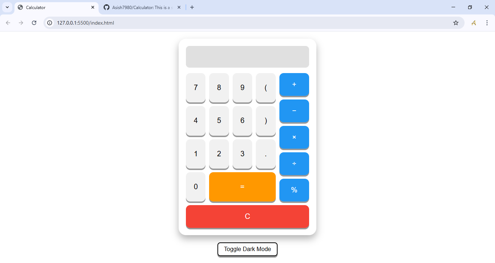
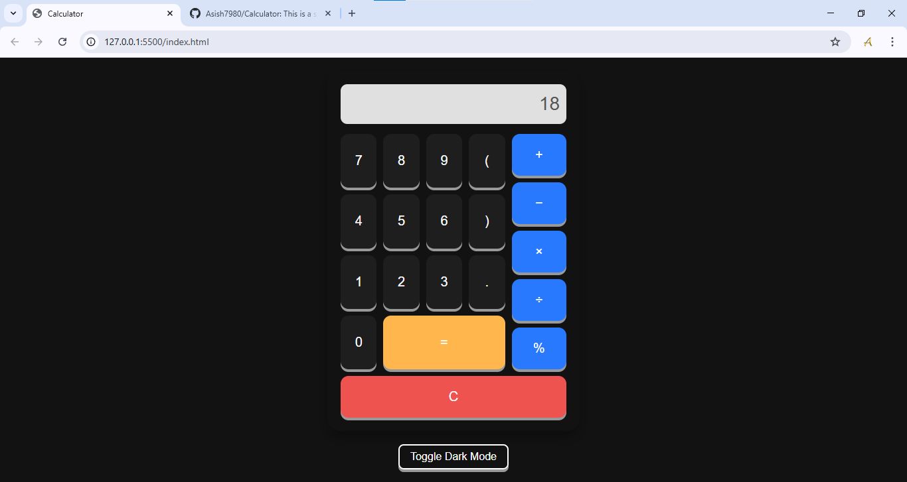

# 🧮 Calculator Web App

A responsive and user-friendly calculator built using HTML, CSS, and JavaScript. This project supports basic arithmetic operations, percentage calculations, keyboard input, and includes a toggle for dark mode.

## ✨ Features

- ✅ Basic arithmetic operations: `+`, `−`, `×`, `÷`
- ✅ Parentheses support for complex expressions
- ✅ Decimal support
- ✅ Percentage calculation (`%`)
- ✅ Clear button to reset input
- ✅ Keyboard support for enhanced usability
- ✅ Responsive design across all screen sizes
- ✅ Dark/Light mode toggle for better UX

## 🖼️ Screenshots

### 💡 Light Mode


### 🌙 Dark Mode



## 🛠️ Tech Stack

- **HTML5**
- **CSS3** (with custom properties and responsive layout)
- **JavaScript (ES6+)**

---

## 🚀 Getting Started

### Prerequisites

No installation required. All files run in the browser.

### Run Locally

1. Clone the repository:
   ```bash
   git clone https://github.com/Asish7980/Calculator.git
Open index.html in any web browser.
```
📁 Folder Structure
Copy code
Calculator/
├── index.html
├── README.md
├── screenshots/
│   ├── light-mode.png
│   └── dark-mode.png
└── ...
```
### 🙌 Acknowledgments
This project was built as part of personal practice and frontend development learning. Inspired by modern calculator layouts and accessible UI principles.

### 📜 License
This project is licensed under the MIT License.

### ✍️ Author
Asish Shaw
